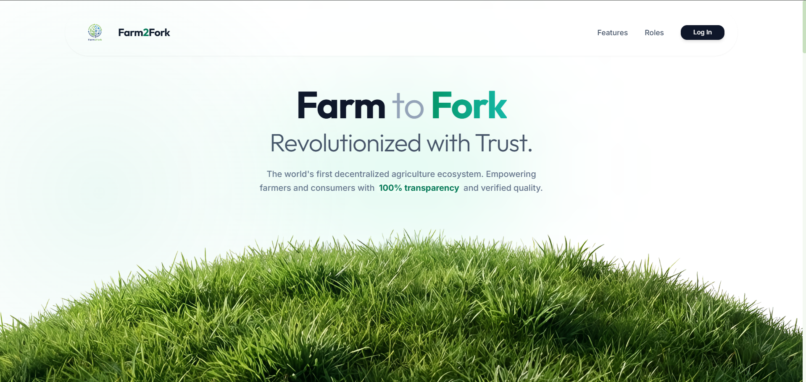
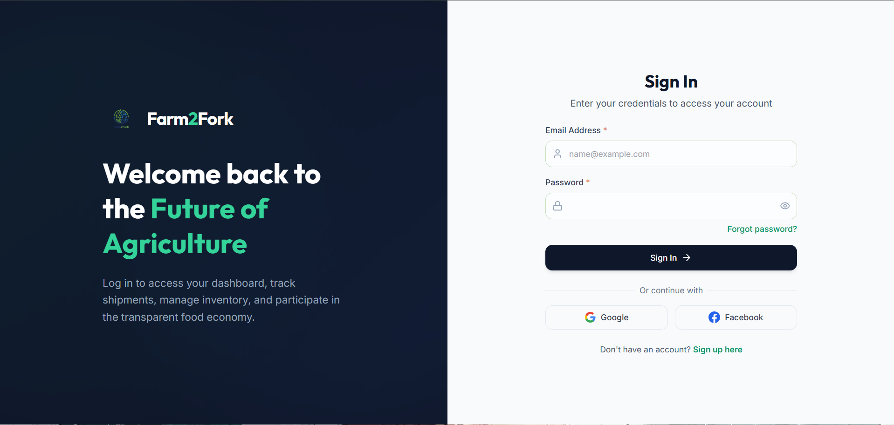
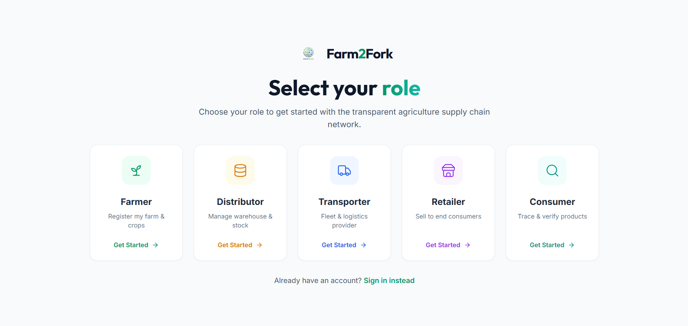
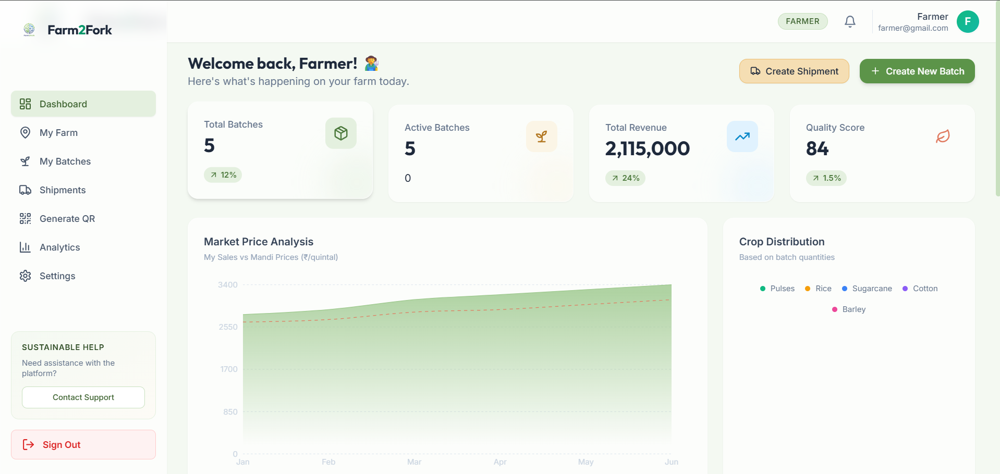
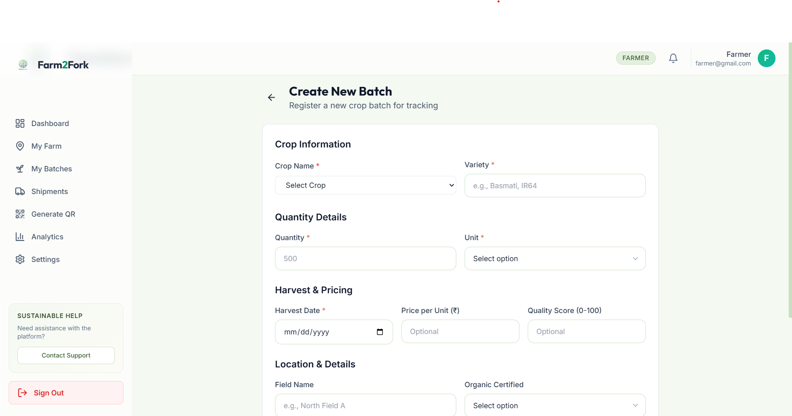
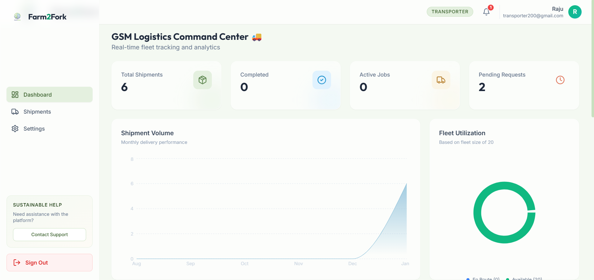
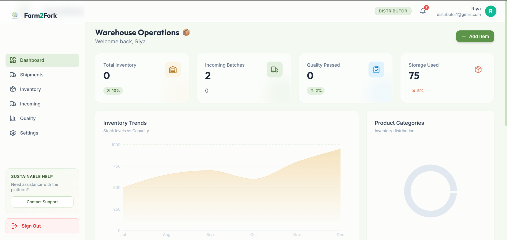
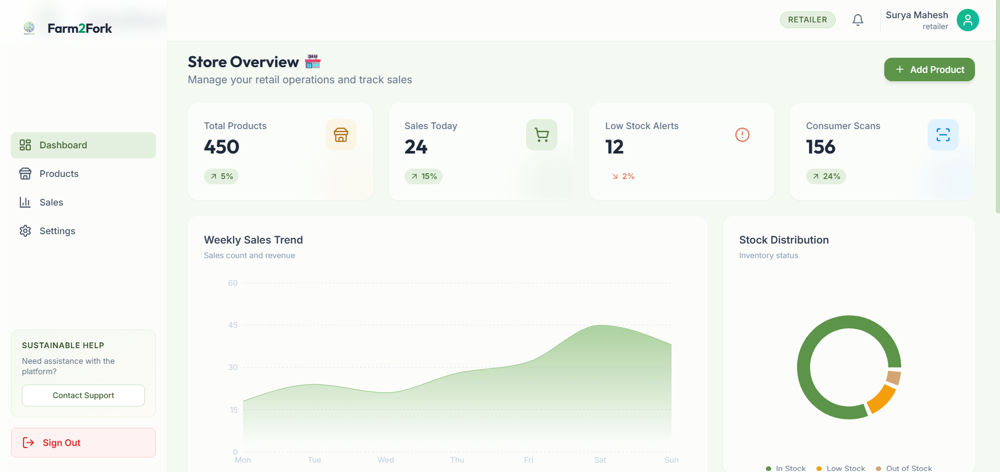
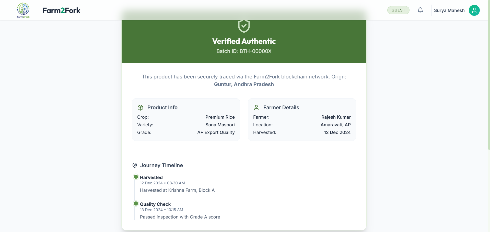

# Farm2Fork 🌾

> A comprehensive agricultural supply chain management platform connecting farmers, transporters, distributors, and retailers for complete farm-to-fork traceability.

## 📋 Table of Contents

- [Overview](#overview)
- [Screenshots](#screenshots)
- [Features](#features)
- [Tech Stack](#tech-stack)
- [Prerequisites](#prerequisites)
- [Installation](#installation)
- [Running the Application](#running-the-application)
- [Project Structure](#project-structure)
- [User Roles](#user-roles)
- [API Documentation](#api-documentation)
- [Testing](#testing)
- [Contributing](#contributing)
- [License](#license)

## 🌟 Overview

Farm2Fork is a modern agricultural supply chain platform designed to bring transparency and efficiency to the entire agricultural value chain. The platform enables complete traceability from farm to consumer, ensuring quality, authenticity, and fair pricing throughout the supply chain.

### Key Highlights

- **Multi-role Platform**: Supports farmers, transporters, distributors, retailers, and administrators
- **Complete Traceability**: QR code-based batch tracking from farm to consumer
- **Real-time Tracking**: Live shipment tracking and status updates
- **Analytics Dashboard**: Comprehensive insights for all stakeholders
- **Secure Authentication**: Role-based access control with JWT authentication
- **Modern UI/UX**: Beautiful, responsive interface built with React and Tailwind CSS

## 📸 Screenshots

### Landing Page

*Modern, responsive landing page with engaging animations*

### Authentication

*Secure role-based login interface*


*User-friendly registration with role selection*

### Farmer Dashboard

*Comprehensive farmer dashboard with batch management and analytics*


*Intuitive batch creation interface*


### Transporter Dashboard

*Real-time shipment tracking and route management*

### Distributor Dashboard

*Inventory management and quality control interface*

### Retailer Dashboard

*Product management and sales tracking*

### Product Traceability

*Consumer-facing product traceability feature with complete supply chain journey*

---

> 💡 **Note**: To add your screenshots, create a `screenshots` folder in the project root and place your images there. Update the filenames in the links above to match your screenshot names.

## ✨ Features

### For Farmers 👨‍🌾
- Create and manage crop batches
- Generate QR codes for product traceability
- Create shipments to distributors/retailers
- Track farm analytics and performance
- Manage farm details and KYC information

### For Transporters 🚛
- View and accept shipment requests
- Real-time route tracking
- Update shipment status and location
- Manage vehicle fleet
- Analytics on completed deliveries

### For Distributors 📦
- Receive and manage incoming shipments
- Quality control and inspection
- Inventory management
- Forward shipments to retailers
- Track product journey

### For Retailers 🏪
- Receive products from distributors
- Manage product inventory
- Sales tracking and reporting
- Customer-facing product information

### For Consumers 👥
- Scan QR codes to trace product journey
- View complete supply chain history
- Verify product authenticity
- See product origin and handling details

### For Administrators 🔐
- User management and approvals
- Platform-wide analytics
- Monitor all transactions
- System configuration

## 🛠️ Tech Stack

### Frontend
- **Framework**: React 18 with Vite
- **Routing**: React Router DOM
- **Styling**: Tailwind CSS with custom design system
- **Animations**: Framer Motion, GSAP, Lottie
- **3D Graphics**: Three.js with React Three Fiber
- **Forms**: React Hook Form with Zod validation
- **Charts**: Recharts
- **QR Codes**: react-qr-code, html5-qrcode
- **UI Components**: Lucide React icons

### Backend
- **Runtime**: Node.js
- **Framework**: Express.js
- **Database**: MongoDB with Mongoose ODM
- **Authentication**: JWT (JSON Web Tokens)
- **Security**: bcrypt for password hashing
- **Validation**: Express Validator
- **CORS**: Enabled for cross-origin requests

### Development Tools
- **Build Tool**: Vite
- **Code Quality**: ESLint
- **Dev Server**: Nodemon (backend)
- **Version Control**: Git

## 📦 Prerequisites

Before you begin, ensure you have the following installed:

- **Node.js** (v16 or higher) - [Download](https://nodejs.org/)
- **MongoDB** (v6 or higher) - [Download](https://www.mongodb.com/try/download/community)
- **npm** or **yarn** package manager
- **Git** - [Download](https://git-scm.com/)

## 🚀 Installation

### 1. Clone the Repository

```bash
git clone https://github.com/SuryaMahesh04/FarmtoFork.git
cd FarmtoFork
```

### 2. Install Frontend Dependencies

```bash
npm install
```

### 3. Install Backend Dependencies

```bash
cd backend
npm install
cd ..
```

### 4. Configure Environment Variables

#### Backend Configuration

The backend `.env` file is already configured in `backend/.env`:

```env
PORT=5000
MONGODB_URI=mongodb://localhost:27017/farm2fork
JWT_SECRET=farm2fork_super_secret_jwt_key_change_this_in_production_2024
JWT_EXPIRES_IN=24h
CLIENT_URL=http://localhost:5173
```

> ⚠️ **Production Note**: Make sure to change the `JWT_SECRET` to a strong, unique value in production!

#### Frontend Configuration (if needed)

Create a `.env` file in the root directory if you need to customize the API URL:

```env
VITE_API_URL=http://localhost:5000
```

## 🏃‍♂️ Running the Application

### 1. Start MongoDB

Make sure MongoDB is running on your system.

**Windows:**
```bash
net start MongoDB
```

**macOS (with Homebrew):**
```bash
brew services start mongodb-community
```

**Linux:**
```bash
sudo systemctl start mongod
```

### 2. Start Backend Server

Open a terminal and run:

```bash
cd backend
npm run dev
```

The backend server will start on `http://localhost:5000`

### 3. Start Frontend Development Server

Open a new terminal and run:

```bash
npm run dev
```

The frontend will start on `http://localhost:5173`

### 4. Access the Application

Open your browser and navigate to:
```
http://localhost:5173
```

## 📁 Project Structure

```
FarmtoFork/
├── backend/                 # Backend API
│   ├── src/
│   │   ├── config/         # Configuration files
│   │   ├── controllers/    # Request handlers
│   │   ├── middleware/     # Custom middleware
│   │   ├── models/         # MongoDB models
│   │   ├── routes/         # API routes
│   │   ├── utils/          # Utility functions
│   │   └── server.js       # Entry point
│   ├── .env                # Environment variables
│   └── package.json        # Backend dependencies
│
├── src/                    # Frontend source
│   ├── components/         # React components
│   │   ├── forms/         # Form components (onboarding)
│   │   ├── layout/        # Layout components
│   │   └── ui/            # Reusable UI components
│   ├── pages/             # Page components
│   │   ├── farmer/        # Farmer dashboard pages
│   │   ├── transporter/   # Transporter pages
│   │   ├── distributor/   # Distributor pages
│   │   ├── retailer/      # Retailer pages
│   │   ├── admin/         # Admin pages
│   │   └── consumer/      # Consumer pages
│   ├── utils/             # Utility functions
│   ├── data/              # Static data
│   ├── assets/            # Images, fonts, etc.
│   ├── App.jsx            # Main app component
│   ├── main.jsx           # Entry point
│   └── index.css          # Global styles
│
├── api/                   # API integration
├── index.html             # HTML template
├── vite.config.js         # Vite configuration
├── tailwind.config.js     # Tailwind configuration
├── package.json           # Frontend dependencies
├── SETUP_GUIDE.md         # Detailed setup guide
└── README.md              # This file
```

## 👥 User Roles

### 1. Farmer
- Role ID: `farmer`
- Dashboard: `/farmer`
- Capabilities: Create batches, generate QR codes, create shipments, track analytics

### 2. Transporter
- Role ID: `transporter`
- Dashboard: `/transporter`
- Capabilities: Accept shipments, update delivery status, route management

### 3. Distributor
- Role ID: `distributor`
- Dashboard: `/distributor`
- Capabilities: Receive shipments, quality control, inventory management, forward to retailers

### 4. Retailer
- Role ID: `retailer`
- Dashboard: `/retailer`
- Capabilities: Receive products, manage inventory, sales tracking

### 5. Administrator
- Role ID: `admin`
- Dashboard: `/admin`
- Capabilities: User management, platform analytics, system configuration

## 🔌 API Documentation

### Base URL
```
http://localhost:5000/api
```

### Authentication Endpoints

#### Register User
```http
POST /auth/register
Content-Type: application/json

{
  "email": "user@example.com",
  "password": "securePassword123",
  "role": "farmer"
}
```

#### Login User
```http
POST /auth/login
Content-Type: application/json

{
  "email": "user@example.com",
  "password": "securePassword123",
  "role": "farmer"
}
```

#### Get Current User
```http
GET /auth/me
Authorization: Bearer <JWT_TOKEN>
```

### Protected Routes

All dashboard and data routes require JWT authentication:
```http
Authorization: Bearer <JWT_TOKEN>
```

For detailed API documentation, see the [SETUP_GUIDE.md](./SETUP_GUIDE.md#api-testing-optional) file.

## 🧪 Testing

### Testing the Authentication Flow

1. **Register a New User**
   - Go to `http://localhost:5173/signup`
   - Select a role (e.g., Farmer)
   - Complete the onboarding form
   - You'll be automatically logged in

2. **Login with Existing User**
   - Go to `http://localhost:5173/login`
   - Select your role
   - Enter credentials
   - Access your dashboard

3. **Verify in MongoDB**
   - Open MongoDB Compass
   - Connect to `mongodb://localhost:27017`
   - Check the `farm2fork` database
   - View the `users` collection

For detailed testing instructions, refer to [SETUP_GUIDE.md](./SETUP_GUIDE.md#testing-the-authentication-flow).

## 🎯 Roadmap

- [x] User authentication and role-based access
- [x] Farmer batch creation and management
- [x] QR code generation for products
- [x] Shipment creation and tracking
- [x] Multi-role dashboards
- [x] Analytics and reporting
- [ ] Mobile application (iOS/Android)
- [ ] Blockchain integration for immutable records
- [ ] Payment gateway integration
- [ ] Multi-language support
- [ ] SMS/Email notifications
- [ ] Advanced analytics with AI/ML

## 🤝 Contributing

Contributions are welcome! Please follow these steps:

1. Fork the repository
2. Create a feature branch (`git checkout -b feature/AmazingFeature`)
3. Commit your changes (`git commit -m 'Add some AmazingFeature'`)
4. Push to the branch (`git push origin feature/AmazingFeature`)
5. Open a Pull Request

## 📄 License

This project is licensed under the ISC License - see the LICENSE file for details.

## 👨‍💻 Authors

- **SuryaMahesh04** - [GitHub Profile](https://github.com/SuryaMahesh04)

## 🙏 Acknowledgments

- Thanks to all contributors who have helped shape this project
- Inspired by the need for transparency in agricultural supply chains
- Built with modern web technologies and best practices

## 📞 Support

For support, questions, or suggestions:
- Open an issue on GitHub
- Contact the development team

---

**Made with ❤️ for farmers and the agricultural community**
